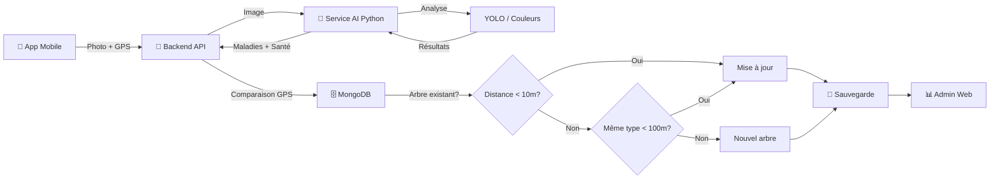

# 🚀 Guide de Démarrage Rapide - Analyse AI d'Arbres

## 📋 Prérequis

1. **Python 3.8+** - [Télécharger ici](https://www.python.org/downloads/)
2. **Node.js 16+** - [Télécharger ici](https://nodejs.org/)
3. **MongoDB** - [Télécharger ici](https://www.mongodb.com/try/download/community)
4. **Flutter SDK** - [Installation](https://flutter.dev/docs/get-started/install) (pour l'app mobile)

## ⚡ Démarrage en 3 Commandes

### Option 1: Script Automatique (Recommandé - Windows)

```powershell
# 1. Démarrer tous les services automatiquement
.\start-all-services.ps1

# 2. Tester que tout fonctionne
.\test-ai-service.ps1

# 3. Démarrer l'app mobile
cd app2
flutter run
```

### Option 2: Démarrage Manuel

#### Terminal 1 - Service AI (Python)
```bash
cd Backend
pip install -r requirements.txt
cd src/services
python ai_analysis_server.py
```

#### Terminal 2 - Backend API (Node.js)
```bash
cd Backend
npm install
npm start
```

#### Terminal 3 - Frontend Web (React)
```bash
cd Frontend
npm install
npm start
```

#### Terminal 4 - App Mobile (Flutter)
```bash
cd app2
flutter pub get
flutter run
```

## 🧪 Test de l'Installation

### 1. Vérifier le Service AI
```bash
curl http://localhost:5001/health
```
**Attendu:** `{"status":"ok","mode":"basic"}`

### 2. Vérifier le Backend API
```bash
curl http://localhost:5000/health
```
**Attendu:** `{"status":"ok"}`

### 3. Test d'Analyse avec une Image
```bash
curl -X POST http://localhost:5001/analyze \
  -F "file=@test_tree.jpg" \
  -F "tree_type=Olivier" \
  -F "gps_data={\"latitude\":36.8065,\"longitude\":10.1815}"
```

## 📱 Utilisation de l'Application Mobile

1. **Lancer l'app** : `flutter run`
2. **Se connecter** avec un compte existant
3. **Navigation** : Menu → "Analyse d'Arbre"
4. **Workflow** :
   - ✅ Sélectionner le type d'arbre (ex: Olivier, Palmier)
   - ✅ Capturer ou choisir une photo
   - ✅ GPS est automatiquement détecté
   - ✅ Lancer l'analyse → L'AI analyse l'image
   - ✅ Voir les résultats : maladies, santé, recommandations

## 🌐 Accès Web Admin

- **URL:** http://localhost:3000
- **Login:** Compte administrateur
- **Pages:**
  - `/analysis-history` - Historique de toutes les analyses
  - `/trees/:treeId/analyses` - Rapports par arbre

## 📊 Ports Utilisés

| Service | Port | URL |
|---------|------|-----|
| Service AI (Python) | 5001 | http://localhost:5001 |
| Backend API (Node.js) | 5000 | http://localhost:5000 |
| Frontend Web (React) | 3000 | http://localhost:3000 |
| MongoDB | 27017 | mongodb://localhost:27017 |

## 🔧 Configuration

### Variables d'Environnement (Backend/.env)
```env
PORT=5000
MONGODB_URI=mongodb://localhost:27017/soliferme
JWT_SECRET=your_secret_key_here
AI_SERVICE_URL=http://localhost:5001
NODE_ENV=development
```

### Variables d'Environnement (Backend/src/services/.env)
```env
FLASK_PORT=5001
AI_MODE=basic  # ou 'full' si modèles YOLO disponibles
MODEL_PATH=./models
```

## 🚨 Dépannage Rapide

### Problème: Service AI ne démarre pas
```bash
# Vérifier Python
python --version  # Doit être 3.8+

# Réinstaller les dépendances
cd Backend
pip install -r requirements.txt --force-reinstall
```

### Problème: Backend API ne trouve pas le Service AI
```bash
# Vérifier que le Service AI tourne
curl http://localhost:5001/health

# Si non, vérifier Backend/.env
echo $AI_SERVICE_URL  # Doit être http://localhost:5001
```

### Problème: Erreur de permission GPS sur mobile
```bash
# Android
flutter pub add geolocator
flutter pub add permission_handler

# iOS - Modifier ios/Runner/Info.plist
<key>NSLocationWhenInUseUsageDescription</key>
<string>Nécessaire pour localiser les arbres</string>
```

### Problème: Modèles YOLO manquants
Le système fonctionne en **mode basique** sans YOLO (analyse de couleur).
Pour activer le mode complet:
```bash
cd Backend/src/services
mkdir -p models
# Télécharger YOLOv8: https://github.com/ultralytics/ultralytics
```

## 📚 Documentation Complète

- **Service AI:** [Backend/AI_SERVICE_README.md](Backend/AI_SERVICE_README.md)
- **Implémentation:** [IMPLEMENTATION_GUIDE.md](IMPLEMENTATION_GUIDE.md)
- **Code AI Original:** [AI/](AI/) (fichiers de référence)

## 🎯 Workflow Complet d'Analyse



## ✅ Checklist de Vérification

- [ ] Python 3.8+ installé
- [ ] Node.js 16+ installé
- [ ] MongoDB en cours d'exécution
- [ ] `pip install -r Backend/requirements.txt` réussi
- [ ] `npm install` dans Backend réussi
- [ ] Service AI démarre sur port 5001
- [ ] Backend API démarre sur port 5000
- [ ] Test curl réussit
- [ ] App mobile compile avec `flutter run`
- [ ] GPS fonctionne sur le device/émulateur
- [ ] Photo capture fonctionne
- [ ] Analyse retourne des résultats

## 🆘 Support

### Logs à vérifier
```bash
# Logs du Service AI
# Affichés dans le terminal où tourne ai_analysis_server.py

# Logs du Backend
# Affichés dans le terminal où tourne npm start

# Logs MongoDB
# Vérifier dans MongoDB logs: /var/log/mongodb/mongod.log
```

### Commandes de Diagnostic
```bash
# Voir tous les processus Node/Python
Get-Process | Where-Object {$_.Name -match "node|python"}

# Vérifier les ports occupés
netstat -ano | findstr "5000 5001 3000"

# Tester la connexion MongoDB
mongosh --eval "db.adminCommand('ping')"
```

## 🎉 Prêt!

Une fois tous les services démarrés, vous pouvez:
1. Utiliser l'app mobile pour analyser des arbres
2. Consulter l'historique sur l'interface web admin
3. Voir les rapports détaillés par arbre

---

**🏁 Bon développement!**
